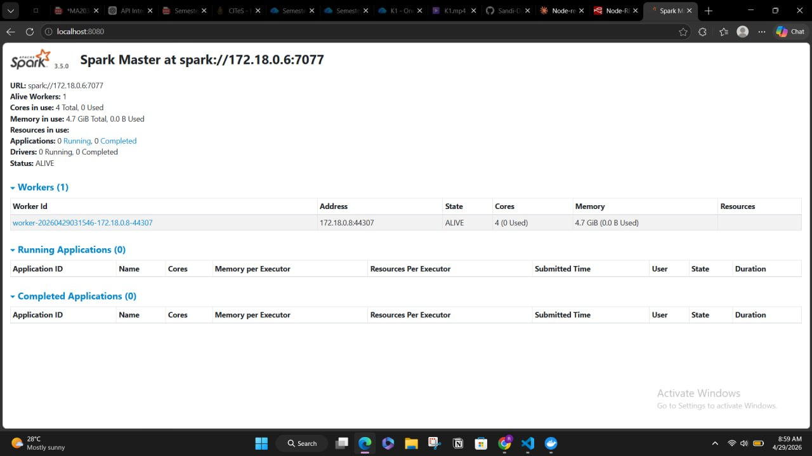

# C2 — Smart Agriculture Platform
## Ingestion & API Exposure

**Member:** Sandali  
**Theme:** Ingestion & API Exposure  
**Tools:** Apache Kafka, Node-RED, MQTT, Spark Streaming, FastAPI  
**Organization:** [AgriSenseNet](https://github.com/AgriSenseNet)

---

## 📋 Overview

This repository contains the **C2 Data Ingestion & API layer** of the Smart Agriculture Platform. It is responsible for:

- Receiving sensor data from C1 (ESP32) via MQTT
- Routing and validating data through Apache Kafka topics
- Detecting anomalies using Z-score stream processing
- Exposing processed data via FastAPI endpoints to C3

---

## 🏗️ System Architecture

```
C1 (ESP32 Sensors)
        ↓ MQTT (broker.hivemq.com:1883)
    Mosquitto Broker
        ↓
    Node-RED (Validate & Route)
        ↓
    Apache Kafka Topics
        ↓
    Spark Stream Processor (Anomaly Detection)
        ↓
    FastAPI Layer → C3 Dashboard
```

---

## 📁 Project Structure

```
smart-agri-c2/
├── kafka/
│   ├── docker-compose.yml        # All services
│   └── nodered_data/
│       └── flows.json            # Node-RED flows
├── streaming/
│   ├── stream_processor.py       # Spark/Python anomaly detection
│   └── Dockerfile
├── api/
│   ├── main.py                   # FastAPI endpoints
│   ├── requirements.txt
│   └── Dockerfile
├── configs/
│   └── mqtt-config.md            # MQTT topic mapping
├── evidence/                     # Sprint evidence screenshots
└── README.md
```

---

## 🚀 Sprint 1 — Infrastructure & Ingestion

### Kafka Broker Setup

Deployed using Docker Compose with Zookeeper.

**Kafka Topics Created:**

| Topic | Description | Retention |
|---|---|---|
| `sensor.soil_moisture` | Soil moisture readings (%) | 7 days |
| `sensor.soil_temp` | Soil temperature (°C) | 7 days |
| `sensor.ambient_temp` | Ambient temperature (°C) | 7 days |
| `sensor.humidity` | Humidity readings (%) | 7 days |
| `sensor.pressure` | Atmospheric pressure (hPa) | 7 days |
| `sensor.solar_radiation` | Solar radiation (W/m²) | 7 days |
| `sensor.anomaly_candidates` | Flagged anomaly readings | 7 days |
| `sensor.dlq` | Dead Letter Queue (invalid messages) | 7 days |

### Evidence — Kafka Topics & Sample Messages


---

### MQTT → Kafka Bridge (Node-RED)

**Message Schema (agreed with C1):**
```json
{
  "device_id": "esp32-01",
  "field_id": "field1",
  "timestamp": "2026-04-28T00:00:00Z",
  "parameter": "soil_moisture",
  "value": 42.5,
  "unit": "%"
}
```

**Node-RED Flow:**
```
[C1 MQTT In] → [Map C1 to Schema] → [Validate & Route] → [Kafka Producer]
[Inject Nodes] →                                        → [Kafka DLQ]
```

**C1 MQTT Topic Mapping:**

| C1 MQTT Topic | Kafka Topic |
|---|---|
| `zone1/sensors/temperature` | `sensor.ambient_temp` |
| `zone1/sensors/humidity` | `sensor.humidity` |
| `zone1/sensors/pressure` | `sensor.pressure` |
| `zone1/sensors/soil_moisture` | `sensor.soil_moisture` |

### Evidence — Node-RED Debug Panel & C1 Connection


---

## ⚡ Sprint 2 — Stream Processing & Anomaly Detection

### Z-Score Anomaly Detection

The `stream_processor.py` reads from all 6 Kafka sensor topics and:

1. Maintains a **rolling window of 100 readings** per sensor parameter
2. Computes **Z-score** for each new reading
3. If **|Z| > 3** → flags as `statistical_outlier`
4. Sends anomalous readings to `sensor.anomaly_candidates`
5. Adds derived fields: `rolling_mean`, `zscore`, `processed_at`

**Example Anomaly Detection:**

| Reading | Z-score | Decision |
|---|---|---|
| soil_moisture = 45% | 0.2 | ✅ Normal |
| soil_moisture = 95% | 4.5 | 🚨 Anomaly! |

### Evidence — Spark Master UI



---

## 🌐 Sprint 3 — FastAPI Endpoints

### Available Endpoints

| Method | Endpoint | Description |
|---|---|---|
| `GET` | `/health` | Service health check |
| `GET` | `/predict/yield` | Predict crop yield |
| `POST` | `/optimize/irrigation` | Optimize irrigation schedule |
| `GET` | `/forecast/soil-moisture` | 24h soil moisture forecast |
| `GET` | `/anomalies/sensors` | Get detected anomalies |
| `GET` | `/classify/growth-stage` | Classify crop growth stage |
| `GET` | `/compute/evapotranspiration` | Compute ET values |

### Authentication

All endpoints require API key header:
```
X-API-Key: your-api-key
```

### API Documentation

Available at:
- Swagger UI: `http://localhost:8000/docs`
- ReDoc: `http://localhost:8000/redoc`

---

## 🐳 How to Run

### Prerequisites
- Docker Desktop
- Git

### Steps

```bash
# Clone the repo
git clone https://github.com/AgriSenseNet/c2-ingestion.git
cd c2-ingestion/kafka

# Create Node-RED data folder
mkdir nodered_data

# Start all services
docker compose up -d

# Verify containers
docker ps
```

### Services Started:
| Service | Port | URL |
|---|---|---|
| Kafka | 9092 | `kafka:9092` |
| Zookeeper | 2181 | - |
| MQTT | 1883 | `localhost:1883` |
| Node-RED | 1880 | `http://localhost:1880` |
| Spark Master | 8080 | `http://localhost:8080` |
| FastAPI | 8000 | `http://localhost:8000/docs` |

### Verify Kafka Topics:
```bash
docker exec -it kafka kafka-topics.sh --list --bootstrap-server kafka:9092
```

### Consume Sample Messages:
```bash
docker exec -it kafka kafka-console-consumer.sh \
  --bootstrap-server kafka:9092 \
  --topic sensor.soil_moisture \
  --from-beginning --max-messages 1
```

---

## 🤝 Integration with Other Teams

### For C1 (ESP32 Team):
- **MQTT Broker:** `broker.hivemq.com:1883`
- **Publish to:** `zone1/sensors/{sensor_type}`

### For Database Team:
- **Kafka Broker:** `localhost:9092`
- **Subscribe to topics:** all `sensor.*` topics

### For C3 (Dashboard Team):
- **API Base URL:** `http://localhost:8000`
- **Docs:** `http://localhost:8000/docs`
- **Auth:** `X-API-Key` header required

---

## 👩‍💻 Author

**Sandali** — C2 Data & Intelligence Subgroup  
Smart Agriculture Platform | Group C | April 2026
